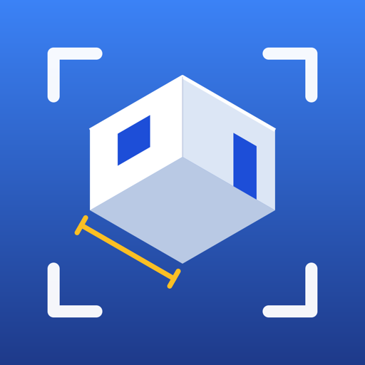
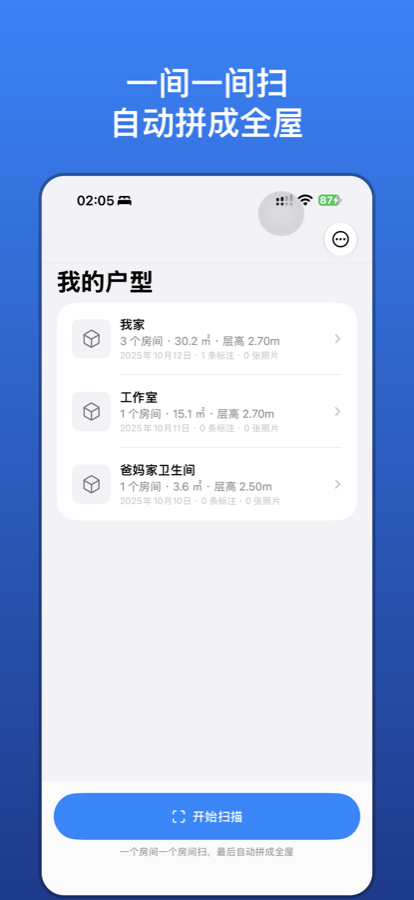
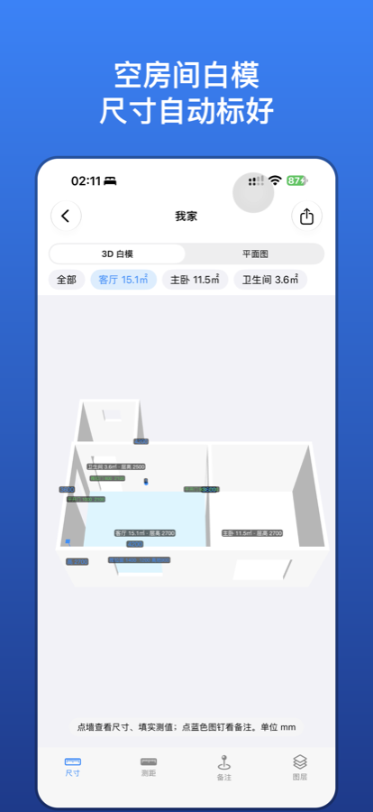
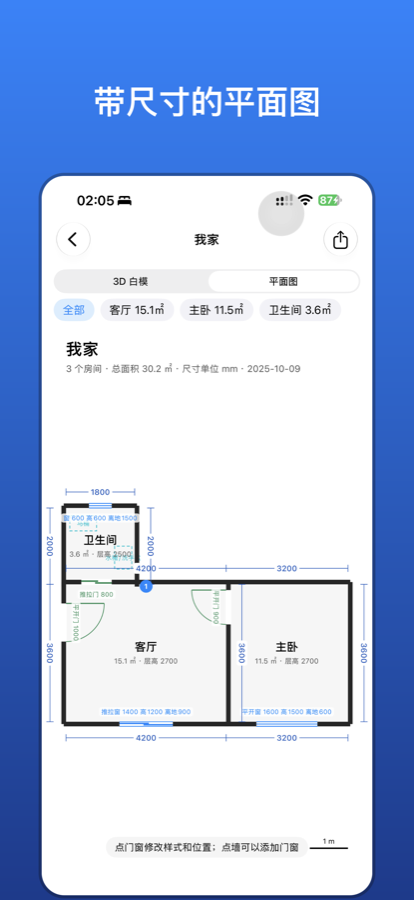
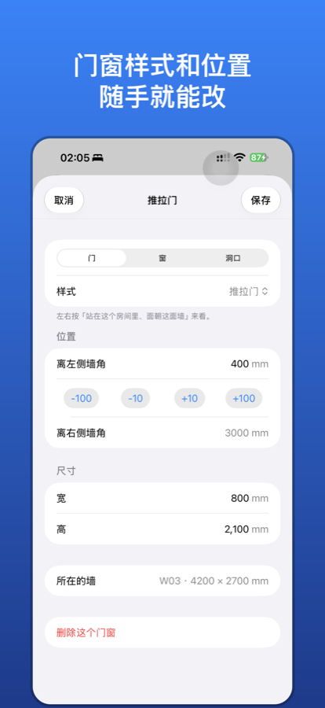

<p align="center">
  
</p>

<h1 align="center">全屋白模 · RoomScan</h1>

<p align="center">
  用 iPhone 的 LiDAR 一间一间扫描房间，自动拼成全屋，生成<b>空房间白模</b>和<b>带尺寸的平面图</b>，一键导出给 AI 在 Blender 里做室内设计。<br>
  Scan your home room by room with iPhone LiDAR, get an empty <b>whitebox 3D model</b> and a <b>dimensioned floor plan</b>, and export everything for AI-assisted interior design in Blender.
</p>

<p align="center">
  <a href="https://srmming.github.io/RoomScan/">网站 Website</a> ·
  <a href="https://srmming.github.io/RoomScan/privacy.html">隐私政策 Privacy</a> ·
  <a href="https://github.com/srmming/RoomScan/issues">反馈 Feedback</a>
</p>

<p align="center">
  
  
  
  
</p>

---

## 功能

- **多房间扫描**：基于 Apple RoomPlan，扫完一个房间命名后接着扫下一个，最后自动拼成全屋
- **自动拍照**：扫描时手机拿稳就自动拍，每张照片记录拍摄位置、朝向和拍到的墙
- **白模**：只保留墙、地面和门窗洞口，墙上的门洞窗洞是真的挖空的；家具全部去掉
- **尺寸**：墙长、层高、门窗宽高和离地高度自动标注；梁下等较矮的墙单独标出墙高
- **标注**：测距、备注、附照片；用卷尺量过的墙可以填「实测值」
- **固定设施参考层**：马桶、洗手盆、灶台、洗衣机等位置（决定水电位）
- **导出给 AI**：一个 zip 包，包含
  - `whitebox.obj` / `whitebox.usda`：白模
  - `floorplan.png` / `floorplan.pdf`：尺寸平面图（单位 mm）
  - `scene.json`：房间、墙、门窗、设施、备注、照片位姿的结构化数据
  - `build_whitebox.py`：Blender 脚本，按真实尺寸重建白模，并给每张照片还原一台同角度的相机
  - `AI_README.md`：给 AI 读的说明

所有数据只保存在手机本地，App 不联网、不收集任何数据。

## 设备要求

- 带 LiDAR 的 iPhone（iPhone 12 Pro 及之后的 Pro / Pro Max）
- iOS 18 或更高版本
- 没有 LiDAR 的设备可以安装，但只能加载示例户型查看效果

## 从源码构建

```bash
brew install xcodegen
git clone https://github.com/srmming/RoomScan.git
cd RoomScan
xcodegen generate
open RoomScan.xcodeproj
```

在 Xcode 的 Signing & Capabilities 里把 Team 换成你自己的开发者团队，并把 Bundle Identifier 改成你自己的，然后连上 iPhone 运行。扫描功能必须用真机，模拟器不支持 LiDAR。

单元测试：`xcodebuild test -project RoomScan.xcodeproj -scheme RoomScan -destination 'platform=iOS Simulator,name=iPhone 17'`

## 代码结构

| 目录 | 内容 |
|---|---|
| `RoomScan/Models/` | `FloorPlanData`：唯一的数据源，导出的 `scene.json` 就是它本身；项目存储；示例户型 |
| `RoomScan/Scan/` | RoomPlan 多房间扫描流程，扫描中的手动 / 自动拍照 |
| `RoomScan/Geometry/` | RoomPlan → FloorPlanData 的转换；白模几何（墙按门窗切块、外转角补角） |
| `RoomScan/Viewer/` | SceneKit 3D 查看：尺寸标签、点选、测距、备注、照片位置 |
| `RoomScan/Export/` | 尺寸平面图（PNG / PDF）、OBJ、USDA、导出包打包 |
| `RoomScan/Resources/` | `build_whitebox.py`（Blender 重建脚本）、`AI_README.md`（给 AI 的说明模板） |
| `Design/` | 图标源文件（SVG）和生成脚本 |
| `docs/` | 项目网站（GitHub Pages）：介绍、隐私政策、技术支持 |

`Geometry/WhiteboxBuilder.swift` 和 `Resources/build_whitebox.py` 用的是同一套切墙和补角算法，改其中一个时另一个也要同步改。

坐标约定：右手坐标系，**Z 轴朝上**（和 Blender 一致），单位米，地面 z = 0。

## English

**RoomScan** turns an iPhone with LiDAR into a whole-home measuring tool:

1. Scan each room with Apple RoomPlan and name it; rooms are merged into one floor plan automatically.
2. Photos are captured automatically while scanning, each with its camera pose and the wall it shows.
3. View the empty whitebox model with wall lengths, ceiling heights, and door/window sizes. Add measurements, notes, photos, and tape-measured values.
4. Export a zip with OBJ/USDA whitebox, dimensioned floor plan (PNG/PDF), `scene.json`, photos, and a Blender script that rebuilds the model and recreates every photo camera.

Everything stays on the device. The app has no network features and collects no data. The UI is currently in Chinese.

Build: `brew install xcodegen && xcodegen generate`, then open the project in Xcode, set your own team and bundle identifier, and run on a LiDAR iPhone.

## 许可证 License

[MIT](LICENSE) © 2026 ming zeng
